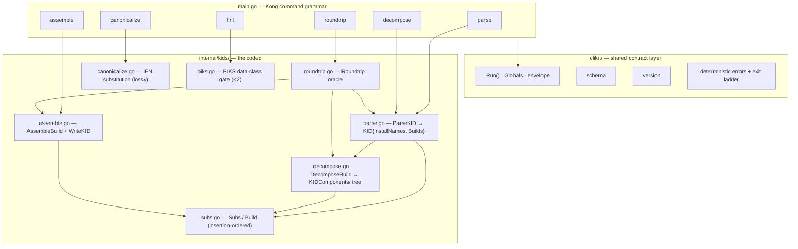
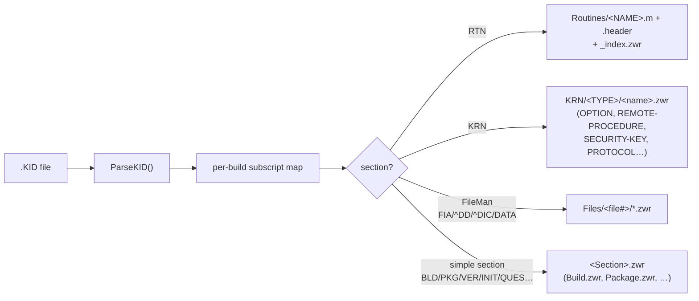
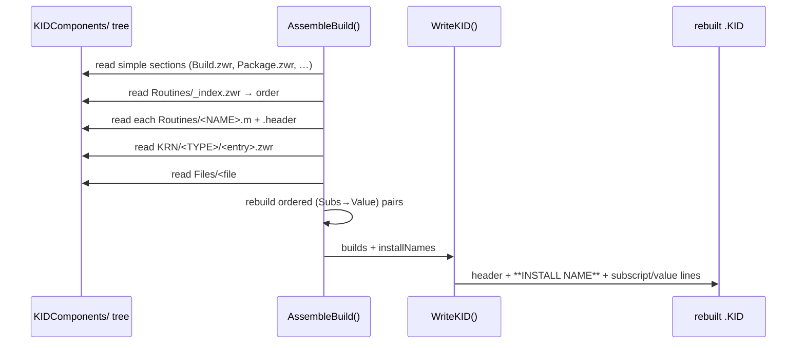
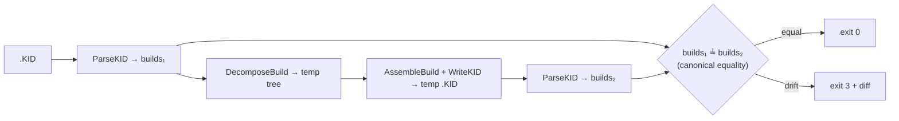
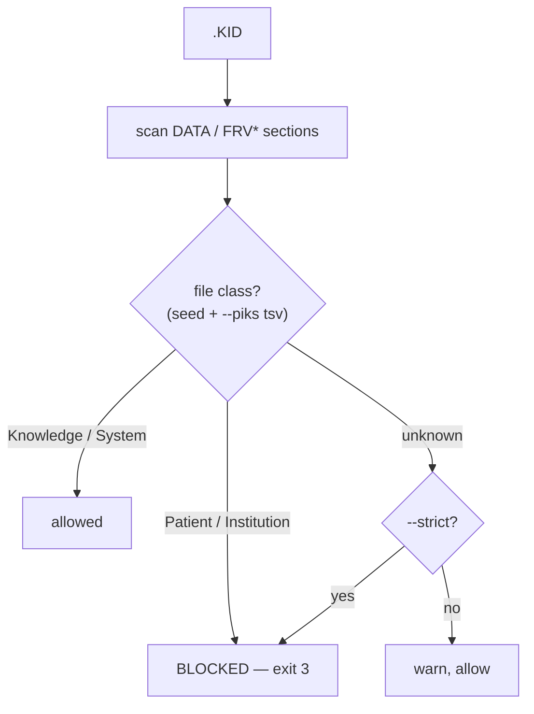
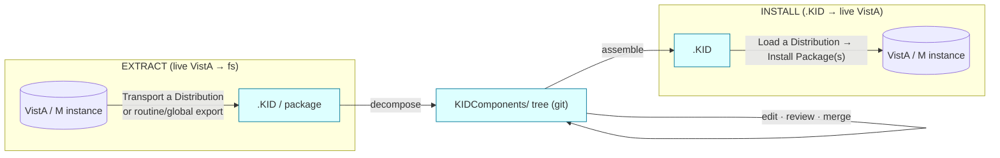

# v pkg — Architecture & the Assembly / Disassembly Process

`v pkg` is the modern front end for the VistA **KIDS** (Kernel Installation and
Distribution System) — the `pkg` domain of the `v` CLI, built on the
`vista-cloud-dev` Go toolchain. This document covers its **format** half: the
round-trip codec that **disassembles** (decomposes) a monolithic `.KID`
distribution file into a per-component tree that diffs and merges cleanly in
git, and **reassembles** that tree back into an installable `.KID`. It explains
how that works and why the round-trip is safe. (The live-engine half —
`build`/`install`/`verify`/`uninstall` — is in
[`kids-installation-automation.md`](kids-installation-automation.md).)

> Scope: this document describes the `v pkg` **codec** *itself* — the file format it reads,
> the data model it builds, and the codec that disassembles and reassembles it.
> For installing a `.KID` into a live VistA instance, see
> [`kids-installation-automation.md`](kids-installation-automation.md); for
> pulling installed packages *out* of a running system, see
> [`package-extraction-design.md`](../proposals/package-extraction-design.md).

---

## Table of Contents

- [1. What problem v pkg solves](#1-what-problem-v-pkg-solves)
- [2. Background: the KIDS distribution format](#2-background-the-kids-distribution-format)
- [3. High-level architecture](#3-high-level-architecture)
- [4. The data model](#4-the-data-model)
- [5. Disassembly (decompose)](#5-disassembly-decompose)
- [6. Assembly (assemble)](#6-assembly-assemble)
- [7. The round-trip guarantee](#7-the-round-trip-guarantee)
- [8. Canonicalization and the PIKS gate](#8-canonicalization-and-the-piks-gate)
- [9. The clikit contract](#9-the-clikit-contract)
- [10. Where v pkg fits in the pipeline](#10-where-v-pkg-fits-in-the-pipeline)
- [References](#references)

---

## 1. What problem v pkg solves

A `.KID` file is the unit VistA developers ship: KIDS bundles routines, FileMan
file/data-dictionary changes, options, protocols, remote procedures (RPCs),
security keys, install questions, and pre-/post-install logic into **one** flat
text file describing one or more *builds* (per the BUILD `#9.6` file). [1]

That single-file packaging is hostile to version control. Adjacent entries in a
`.KID` are semantically independent (two unrelated options, a routine and a
data-dictionary node), but git's line-based diff/merge treats the file as one
stream — so a merge can silently interleave unrelated components and corrupt the
distribution. `v pkg` makes the contents *addressable*: every routine becomes
its own `.m` file, every Kernel component its own `.zwr`, every FileMan file its
own directory. Git then diffs and merges at the granularity of a real change.

The complementary direction — turning that reviewed tree back into a byte-for-
byte equivalent `.KID` that KIDS will install — is what makes the workflow
closed-loop rather than one-way.

`v pkg` is a faithful Go port of `py-kids-vc` (itself a port of Sam Habiel's
`XPDK2VC`); the `decompose`/`assemble`/`roundtrip` contract and the
`KIDComponents/` layout are unchanged from the Python tool. [6][7]

---

## 2. Background: the KIDS distribution format

KIDS replaced the older `DIFROM`/`INIT`-routine export mechanism in Kernel 8.0.
A developer defines a **build entry** in the BUILD (`#9.6`) file, KIDS exports
that definition into a **Transport Global**, and a **Distribution** (typically a
Host File Server file — the `.KID`) carries one or more transport globals to a
site. [1]

A `.KID` is line-oriented text. Conceptually it is a serialized M global: each
*subscript path* is on one line, and the *value* at that subscript is on the
next line. A simplified excerpt (from the `XU*8.0*504` sample):

```
**KIDS**:XU*8.0*504^
**INSTALL NAME**
XU*8.0*504
"BLD",7449,0)
XU*8.0*504^KERNEL^0^3091019
"RTN")
2
"RTN","XU8P504")
0^^B2414286^n/a
"RTN","XU8P504",1,0)
XU8P504 ;OOIFO/AC - POST-INIT ROUTINE ... ;10/19/2009
...
"KRN",19,976,0)
XUS KAAJEE WEB LOGON^KAAJEE BROKER CONTEXT^^B^^^^^^^^KERNEL
```

The leading subscript names the **section**, which determines the component
type:

| Section            | Meaning                                            |
| ------------------ | -------------------------------------------------- |
| `BLD`              | the build entry itself (BUILD `#9.6`)              |
| `PKG`              | PACKAGE (`#9.4`) linkage / national package info   |
| `RTN`              | MUMPS routines (source lines)                      |
| `KRN`              | Kernel components — options, RPCs, keys, protocols |
| `FIA`,`^DD`,`^DIC` | FileMan file attributes & data-dictionary nodes    |
| `DATA`,`FRV*`      | operational file data shipped with the build       |
| `INIT`,`INI`,`PRE` | post-install, pre-install, environment-check refs  |
| `QUES`             | install questions                                  |
| `MBREQ`            | required builds                                    |
| `VER`              | Kernel/FileMan version requirements                |

A routine's **second line** is special: `;;VERSION;PACKAGE;**patches**;date;Build N`.
The patch list, build date, and build number are rewritten by KIDS on *every*
install, so they are volatile and must be handled carefully on round-trip
(§7). [1]

---

## 3. High-level architecture

`v pkg` is a single static (`CGO_ENABLED=0`) binary with two layers:

- **`clikit/`** — the shared convention layer (vendored from `go-cli-template`,
  identical across `m-cli`, `m-ydb`, `irissync`/`m-iris`, …): Kong grammar,
  `--output text|json|auto`, the versioned JSON envelope, deterministic error
  objects, the exit-code ladder, `schema`, and `version`.
- **`internal/kids/`** — the codec: parser, subscript model, decompose,
  assemble, roundtrip, canonicalize, and the PIKS data-class gate.



---

## 4. The data model

Parsing a `.KID` yields a `KID`:

```go
type KID struct {
    InstallNames []string          // ordered build/install names, e.g. ["XU*8.0*504"]
    Builds       map[string]*Build // one Build per install name
}
```

A `Build` is an **insertion-ordered** map of subscript → value. Order matters:
KIDS emits subscripts in a specific sequence, and preserving it is part of the
round-trip contract. A repeated subscript overwrites its value but keeps its
original position (mirroring a MUMPS global / Python dict). [6]

```go
type Pair struct {
    Subs  Subs   // the parsed subscript path, e.g. ("KRN",19,976,0)
    Value string // the value line
}
```

`Subs` models a subscript path as typed elements (string, integer, numeric) so
that:

- **collation** matches MUMPS sort order when a section needs sorting, and
- **re-serialization** reproduces the exact on-disk form (quoting/escaping
  strings, formatting numerics like `0.4` byte-for-byte). [6]

This typed-subscript model is the heart of the round-trip fidelity: the codec
never round-trips through a lossy string representation of the key.

---

## 5. Disassembly (decompose)

`decompose <kid> <dir>` parses the `.KID` and, for each build, writes a
`<dir>/<BuildDir>/KIDComponents/` tree. The build directory name is the install
name with `*` replaced by `_` (`XU*8.0*504` → `XU_8.0_504`) — the `XPDK2VC`
`PD4FS` convention. [7]



Three handling strategies, by section:

1. **Routines (`RTN`)** are split into one `<NAME>.m` per routine plus a sibling
   `<NAME>.header` (the routine's checksum/metadata line) and a `_index.zwr`
   recording routine order. The `.m` holds the actual MUMPS source — the artifact
   developers actually want to diff.
2. **Kernel components (`KRN`)** are split per entry into
   `KRN/<COMPONENT-TYPE>/<entry-name>.zwr` (e.g.
   `KRN/OPTION/XUS-KAAJEE-WEB-LOGON.zwr`). Each file is a flat ZWR dump of just
   that entry's subscripts, so two unrelated options never share a file.
3. **FileMan files** co-locate their `FIA`, `^DD`, `^DIC`, `SEC`, `IX`, `DATA`,
   `FRV*`, … sections under a per-file directory.
4. **Simple sections** (`BLD`, `PKG`, `VER`, `PRE`, `INI`, `INIT`, `MBREQ`,
   `QUES`, `TEMP`) each map to one flat `<Name>.zwr` (`Build.zwr`,
   `Package.zwr`, `KernelFMVersion.zwr`, `PostInstall.zwr`, …).

Filesystem-unsafe characters in entry names (`/ : * ? "` …) are replaced with
`-`, matching `XPDK2VC`'s sanitization rule. [7]

The sample `XU*8.0*504` build (the KAAJEE proxy-logon patch) decomposes to:

```
XU_8.0_504/KIDComponents/
├── Build.zwr                         # BLD  — the #9.6 build entry
├── Package.zwr                       # PKG  — #9.4 linkage
├── KernelFMVersion.zwr               # VER
├── PostInstall.zwr                   # INIT — post-install ref (POST^XU8P504)
├── RequiredBuild.zwr                 # MBREQ
├── InstallQuestions.zwr             # QUES
├── ORD.zwr
├── Routines/
│   ├── _index.zwr
│   ├── XU8P504.m / .header
│   └── XUSKAAJ1.m / .header
└── KRN/
    ├── OPTION/XUCOMMAND.zwr
    ├── OPTION/XUS-KAAJEE-WEB-LOGON.zwr
    ├── OPTION/XUS-KAAJEE-PROXY-LOGON.zwr
    ├── REMOTE-PROCEDURE/XUS-KAAJEE-GET-USER-VIA-PROXY.zwr
    ├── REMOTE-PROCEDURE/XUS-KAAJEE-GET-CCOW-TOKEN.zwr
    └── SECURITY-KEY/XUKAAJEE_SAMPLE.zwr
```

(See [`../../examples/`](../../examples/) for the full committed tree and a runnable
demo.)

---

## 6. Assembly (assemble)

`assemble <dir> <kid>` is the inverse. It scans the input directory for
`<BuildDir>/KIDComponents/` subtrees, reconstructs each build's ordered
subscript map by reading the component files back in the canonical section
order, and serializes the whole thing to a `.KID` via `WriteKID`.



`WriteKID` emits the KIDS framing: a saved-by header (`KIDS Distribution saved
by v-pkg`), the `**KIDS**:<names>^` line, then for each build an
`**INSTALL NAME**` block followed by the alternating subscript / value lines.
Routine line-2 is written in its canonical form (§7) — KIDS itself re-stamps the
patch list / date / build number at install time. [1]

---

## 7. The round-trip guarantee

> **Round-trip is semantic equality after routine line-2 canonicalization — not
> byte-identity.**

A routine's second line, `;;VER;PKG;**patches**;date;Build N`, carries three
pieces (patch list, build date, build number) that **KIDS rewrites on every
install**. If the codec preserved them verbatim, diffs would churn on every
re-export for no real change. So decompose normalizes line-2 to `;;VER;PKG;;`
(blanking pieces 5–6), and KIDS re-appends the volatile pieces at install time —
installed behavior is unchanged. This is `XPDK2VC`'s "do not include the build
number" fix, inherited verbatim. [6][7]

`roundtrip <kid>` is the **oracle** that proves a build survives the cycle:



It parses, decomposes to a temp dir, reassembles, re-parses, and compares the
two parsed builds for canonical equality. Drift yields exit `3`. Running the
oracle over the full WorldVistA corpus (≈2,404 patches) is the toolchain's
**G6** acceptance gate.

---

## 8. Canonicalization and the PIKS gate

Two optional, safety-oriented verbs:

- **`canonicalize <dir>`** — substitutes install-time **IENs** (internal entry
  numbers, which differ per instance) with the literal `"IEN"` placeholder so
  the same component diffs identically across instances. This is **lossy** and
  **review-only** — never feed a canonicalized tree back to `assemble` for a real
  install. It rewrites `BLD` and `KRN` subscripts in place.

- **`lint <kid>`** — the **PIKS data-class gate (K2)**. It refuses (exit `3`) a
  `.KID` whose operational data sections (`DATA`/`FRV*`) touch a FileMan file
  classified **Patient** or **Institution** — that data must never enter git.
  Classification is at file granularity; the authoritative model lives in
  `vista-meta` and is consumed *by reference* via `--piks <tsv>`, never vendored.
  `--strict` fails closed on unclassified files.



The PIKS gate is **new in the Go port** — it is not in `py-kids-vc`. It doubles
as a PHI/PII tripwire for the inbound/outbound airlock.

---

## 9. The clikit contract

Every command honors the toolchain contract so the tool is scriptable and
agent-discoverable:

- `--output text|json|auto` — styled text on a TTY, machine JSON otherwise.
- A versioned JSON envelope: `{schemaVersion, command, ok, exit, data}`.
- Deterministic error objects and a fixed **exit-code ladder**: `0` ok · `1`
  runtime · `2` usage · `3` check/drift · `4` refused.
- `schema` emits the full command/flag/enum tree as JSON for agent discovery.
- `version` reports version/commit/date/go (stamped via `-ldflags` at build).

`v pkg` uses the same library set as every sibling tool in the org —
`alecthomas/kong` (grammar), `charmbracelet/lipgloss` (styling),
`willabides/kongplete` (completions), `golang.org/x/term` — pinned to identical
versions, built static and `-trimpath`'d.

---

## 10. Where v pkg fits in the pipeline

`v pkg` owns the **format** half of the lifecycle. The runtime halves —
extracting installed packages from a live system, and installing a `.KID` into
one — are separate, engine-facing concerns:



- **Disassembly / assembly** (this tool) — `decompose` ⇄ `assemble`, with
  `roundtrip` as the oracle and `lint`/`canonicalize` as guards.
- **Extraction** — see [`package-extraction-design.md`](../proposals/package-extraction-design.md).
- **Installation** — see [`kids-installation-automation.md`](kids-installation-automation.md).

---

## References

All KIDS-format and option-name details below are drawn from official VA VistA
documentation. The primary source is the current (Aug 2025) Kernel KIDS User
Guide; the menu-tree and security-key facts are corroborated by the Kernel
Technical Manual.

1. Department of Veterans Affairs, OIT. *Kernel 8.0 Systems Management: Kernel
   Installation and Distribution System (KIDS) User Guide*, August 2025. VA
   Software Document Library (VDL), Infrastructure → Kernel.
   <https://www.va.gov/vdl/documents/Infrastructure/Kernel/krn_8_0_sm_kids_ug.pdf>
2. Department of Veterans Affairs. *Kernel 8.0 & Kernel Toolkit 7.3 Technical
   Manual* (`krn_8_0_tm`) — KIDS menu tree (`XPD MAIN`,
   `XPD DISTRIBUTION MENU`, `XPD INSTALLATION MENU`) and security keys
   (`XUPROG`, `XUPROGMODE`). VDL, Infrastructure → Kernel.
   <https://www.va.gov/vdl/application.asp?appid=10>
3. Department of Veterans Affairs. *VA FileMan Developer's Guide* — data
   dictionary / `^DD`/`^DIC` structures and the legacy `DIFROM` export path.
   VDL, Infrastructure → VA FileMan.
   <https://www.va.gov/vdl/application.asp?appid=5>
4. Department of Veterans Affairs. *Kernel 8.0 Developer's Guide: KIDS Developer
   Tools User Guide* — developer build/export options (Create a Build Using
   Namespace, etc.). VDL, Infrastructure → Kernel. *(Recommended fetch — see the
   gap note in the toolchain README; not yet in the gold corpus.)*
5. OSEHRA / WorldVistA community documentation on the `.KID` transport-global
   text format. <https://github.com/WorldVistA>
6. `py-kids-vc` — the Python predecessor this tool ports
   (`decompose`/`assemble`/`roundtrip` contract, line-2 canonicalization).
   <https://github.com/rafael5/py-kids-vc>
7. Sam Habiel, `XPDK2VC` — the original KIDS-to-version-control tool that
   `py-kids-vc` and `v pkg` descend from (Apache-2.0).
