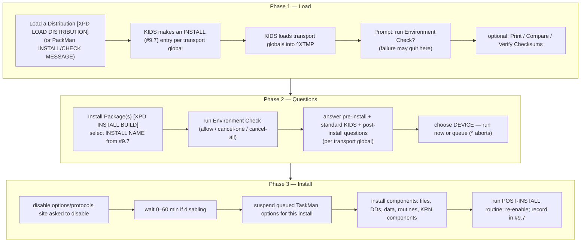
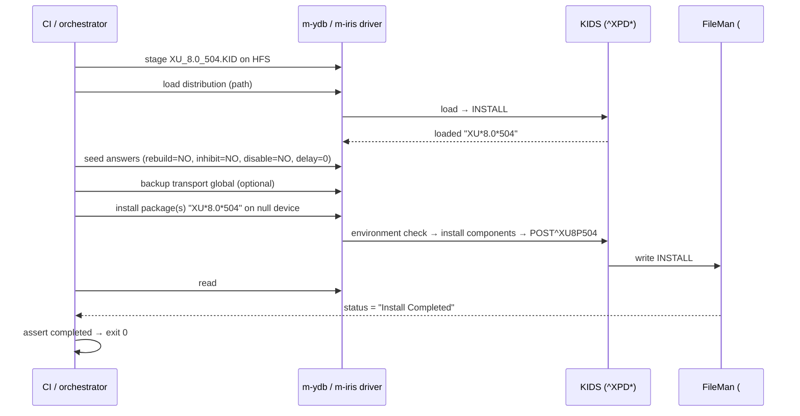

# Automating KIDS Build Installation into a VistA System

A design + procedure document for **installing a `.KID` build into a running
VistA/M instance non-interactively**, suitable for CI, fleet rollout, and the
`vista-cloud-dev` engine drivers (`m-ydb`, `m-iris`).

This document grounds every claim in the official KIDS installer behavior, then
maps that behavior onto a scriptable automation contract.

---

## Table of Contents

- [1. Goal & non-goals](#1-goal--non-goals)
- [2. How a human installs a KIDS build today](#2-how-a-human-installs-a-kids-build-today)
- [3. The three install phases (authoritative)](#3-the-three-install-phases-authoritative)
- [4. What makes installation hard to automate](#4-what-makes-installation-hard-to-automate)
- [5. Proposed automation architecture](#5-proposed-automation-architecture)
- [6. The driver contract](#6-the-driver-contract)
- [7. Worked example: silent install of XU*8.0*504](#7-worked-example-silent-install-of-xu80504)
- [8. Verification & idempotency](#8-verification--idempotency)
- [9. Back-out & rollback](#9-back-out--rollback)
- [10. Safety, sequencing & failure handling](#10-safety-sequencing--failure-handling)
- [11. Open questions](#11-open-questions)
- [References](#references)

---

## 1. Goal & non-goals

**Goal.** Given a `.KID` file (e.g. produced by `v pkg assemble`) and
credentials for a target VistA instance, install the build with **no human at a
terminal**: load the distribution, answer the standard KIDS questions from a
declarative spec, run the install on a chosen device, and report a structured
result.

**Non-goals.**

- Building/exporting distributions (developer side — that is the
  `Edits and Distribution` menu and the KIDS Developer Tools guide). [4]
- Editing the `.KID` content — that is the `v pkg` codec
  ([`architecture.md`](architecture.md)).
- GUI/client-side installs (the `.exe`/`.msi` halves of dual builds) — those are
  workstation deployment, out of scope here.

---

## 2. How a human installs a KIDS build today

Installation lives on the **Installation `[XPD INSTALLATION MENU]`** submenu of
the KIDS main menu **`[XPD MAIN]`**, reached via `Programmer Options [XUPROG]`
on the system manager menu (`EVE`). The KIDS main menu is locked with the
**XUPROG** security key and the Installation menu with **XUPROGMODE**. [1][2]

```
Select Kernel Installation & Distribution System Option: INSTALLATION
   1   Load a Distribution                  [XPD LOAD DISTRIBUTION]
   2   Verify Checksums in Transport Global
   3   Print Transport Global
   4   Compare Transport Global to Current System
   5   Backup a Transport Global
   6   Install Package(s)                   [XPD INSTALL BUILD]
       Restart Install of Package(s)
       Unload a Distribution
```

The canonical sequence a site follows (from the OR\*3.0\*453 installation guide,
representative of essentially every VistA patch) is: [5]

1. Load the build (from a Host File via **Load a Distribution**, or from a
   PackMan MailMan message via **INSTALL/CHECK MESSAGE** / `[XMPACK]`).
2. Optionally **Backup a Transport Global**, **Compare Transport Global to
   Current System**, and **Verify Checksums in Transport Global**.
3. **Install Package(s)**, selecting the INSTALL NAME (e.g. `XU*8.0*504`).
4. Answer the standard KIDS questions:
   - *Want KIDS to Rebuild Menu Trees Upon Completion of Install? NO//*
   - *Want KIDS to INHIBIT LOGONs during the install? NO//*
   - *Want to DISABLE Scheduled Options, Menu Options, and Protocols? NO//*
   - *Delay Install (Minutes): (0 - 60): 0//*
   - *DEVICE:* (choose output device, or queue).

---

## 3. The three install phases (authoritative)

KIDS installs a *standard distribution* in **three phases**. Any automation must
respect these boundaries because each phase has distinct failure semantics. [1]



Key facts that drive the design:

- The **INSTALL (`#9.7`) file** records every installation: the site's answers,
  any output, and timing. It is the source of truth for "did this install, and
  when?" — automation reads it for verification and idempotency. [1]
- Transport globals live in **`^XTMP`** between load and install, so a failed or
  aborted load can be recovered/unloaded without touching live data. [1]
- The **PACKAGE (`#9.4`)** file's *PATCH APPLICATION HISTORY* multiple is updated
  with the patch name + sequence number — the authoritative "is this patch
  applied?" record. [1]

---

## 4. What makes installation hard to automate

KIDS is a **conversational, terminal-driven** subsystem. The obstacles:

1. **Interactive prompts.** The standard questions above are read from the
   principal device. Automation must feed answers in the exact order and format
   KIDS expects, including accepting defaults (`//`).
2. **Variable question sets.** A build can define *pre-install* and
   *post-install* questions (`QUES` section) beyond the standard four. The set
   is build-specific and must be discovered, not hard-coded.
3. **Environment Check gate.** The build's environment-check routine can cancel
   the install; its output is informational and must be captured.
4. **Device selection & queueing.** Installs can run on the principal device or
   be queued to TaskMan; long post-installs (background cross-reference builds,
   etc.) complete asynchronously and must be polled.
5. **Privilege.** The installing user needs the `XUPROG`/`XUPROGMODE` keys and
   programmer access. [2]

---

## 5. Proposed automation architecture

Drive KIDS programmatically rather than scraping a terminal. Two tiers, choose
per environment:

```mermaid
flowchart LR
    KID[".KID (from v pkg assemble)"] --> SPEC

    subgraph plan["Plan layer"]
        SPEC["install-spec.yaml<br/>(answers, device, queue?, backup?)"]
    end

    SPEC --> ORCH["installer orchestrator"]

    subgraph tierA["Tier A — API-driven (preferred)"]
        A1["EN1^XPDIL — load distribution from HFS → ^XTMP + INSTALL #9.7"]
        A2["pre-seed symbol table: XPDDIQ(\"XPZ1/XPO1/XPI1\")=0, Delay=0, null device"]
        A3["EN^XPDIJ(xpda) — task install of the loaded build by #9.7 IEN (ICR 2243)"]
    end
    subgraph tierB["Tier B — expect-driven (fallback)"]
        B1["spawn terminal session"]
        B2["match prompt → send answer"]
    end

    ORCH --> tierA
    ORCH --> tierB
    tierA --> ENG[("VistA / M engine<br/>via m-ydb / m-iris driver")]
    tierB --> ENG
    ENG --> RES["structured result<br/>(read from INSTALL #9.7 + #9.4)"]
```

- **Tier A — API/silent install (preferred). Entry points confirmed from the
  GOLD corpus (2026-06-12), closing the prior gap:**
  - **Load:** `EN1^XPDIL` — the routine behind `[XPD LOAD DISTRIBUTION]`; loads
    the HFS `.KID` into `^XTMP` and creates an INSTALL (#9.7) entry. It is the
    *interactive option routine* (prompts "Enter a Host File:") — there is **no**
    documented param-list silent API (`$$LOAD^XPDID` etc. do **not** exist), so it
    must be driven with the file/device answers pre-seeded.
  - **Install:** `EN^XPDIJ(xpda)` — the one documented *programmatic* install call
    (ICR **#2243**, Controlled Subscription): tasks off the install of an
    **already-loaded** build, where `xpda` = the build's INSTALL (#9.7) IEN. (The
    interactive option routine is `EN^XPDI`.)
  - **Suppress the standard questions** from the env-check via the `XPDDIQ` array:
    `XPDDIQ("XPZ1")=0` (disable options/protocols → NO) is the documented case;
    `XPDDIQ("XPO1")=0` (rebuild menu trees) / `XPDDIQ("XPI1")=0` (inhibit logons)
    follow the same answer-code pattern. Delay = `0`; device = null/non-queued via
    the Kernel IO context (no single documented `XPD*` device var).
  - **Phase:** `XPDENV` = `1` during the install-phase env-check, `0` during the
    load-phase one — guard install-only setup (e.g. `XPDDIQ`) on `XPDENV=1`.
  - **Caveat:** the exact param signatures + non-interactive driving of these
    routines are **not confirmable from docs alone** (the corpus has no XPD*
    routine source) — confirm against a real Kernel routine listing (`%RO`/`ZL`)
    on a live engine before relying on them. So a live FOIA VistA is still
    required to finalize + validate the driver (M0a's "deepest unknown").
- **Tier B — expect-driven (fallback).** When silent APIs are unavailable, drive
  the menu in a pseudo-terminal: send `D ^XUP`/`EVE` → KIDS → `XPD INSTALL
  BUILD`, then a prompt→answer state machine sourced from `install-spec.yaml`.
  Slower and brittler, but works on any instance.

Both tiers terminate by **reading results from FileMan files** (`#9.7`, `#9.4`)
rather than parsing scrolled output — the authoritative, deterministic signal.

A declarative `install-spec.yaml`:

```yaml
install:
  name: "XU*8.0*504"                 # INSTALL NAME / build name
  source: { kind: hfs, path: "/srv/kids/XU_8.0_504.KID" }   # or kind: packman
  environment_check: run             # run | skip
  backup_transport_global: true      # Backup a Transport Global first
  answers:                           # standard KIDS questions
    rebuild_menu_trees: false
    inhibit_logons: false
    disable_options_protocols: false
    delay_install_minutes: 0
  device: { queue: false }           # or { queue: true, at: "2026-06-05T02:00" }
  extra_answers:                     # build-specific pre/post questions
    - prompt_contains: "Provider Role Tool"
      answer: "NO"
```

---

## 6. The driver contract

The orchestrator stays engine-neutral; per-engine specifics live behind the
`m-driver-sdk` Transport seam (`Health · Load · Exec · ReadGlobal · SetGlobal`),
shared by `m-ydb` (YottaDB) and `m-iris` (InterSystems IRIS).

| Step                | Engine-neutral action                                  | Realized via                          |
| ------------------- | ------------------------------------------------------ | ------------------------------------- |
| Stage `.KID`        | put file where M can read it (HFS path)                | host fs / `Load`                      |
| Load distribution   | invoke KIDS load on that path                          | `Exec` (silent API) / Tier B expect   |
| Seed answers        | set `XPD*` symbol-table vars                            | `SetGlobal`/`Exec`                    |
| Install             | run the install (now or queued)                        | `Exec`                                |
| Read result         | read INSTALL `#9.7` + PACKAGE `#9.4` patch history     | `ReadGlobal`                          |
| Health/verify       | confirm routines loaded, checksums match               | `Exec` (XINDEX) / `ReadGlobal`        |

This makes "install a build" a first-class verb the fleet tooling can call the
same way against either engine.

---

## 7. Worked example: silent install of XU*8.0*504

Conceptual flow for the sample build shipped in [`../../examples/`](../../examples/):



The post-install routine (`POST^XU8P504`) adds the KAAJEE proxy entry; for builds
with long background post-installs (e.g. cross-reference rebuilds that pause
every N records), the orchestrator must poll the INSTALL `#9.7` status and any
build-specific completion tag rather than assuming synchronous completion. [5]

### 7.1 Live-proven minimal sequence (ZZSKEL, YottaDB FOIA — 2026-06-12)

The full load → install → verify → uninstall lifecycle was driven end-to-end on
a live FOIA `worldvista/vehu` engine (`GT.M V7.0-005`), installing the throwaway
`ZZSKEL` routine-only package built by `v pkg build`. This is the ground truth
the §11 entry-point research was missing; every claim below was observed live.

**Load** — `EN1^XPDIL` (the `ST→GI` path) reads the host file interactively. Its
`GI` parser expects exactly the layout `v pkg build` emits: line 1 banner, line 2
comment, a `**KIDS**:<name>^` line, a blank terminator, then `**INSTALL NAME**` +
name, then `node)` / `value` pairs to `**END**`. Driving it needs **two** answers
on stdin — the host-file path and accept-default at *"Want to Continue with Load?
YES//"*. On success it populates `^XTMP("XPDI",XPDA,…)` and a `#9.7` INSTALL
entry, and prints *"Use INSTALL NAME: <name> to install this Distribution."*

```m
S DUZ=1,DUZ(0)="@",DT=$$DT^XLFDT,U="^"
D EN1^XPDIL          ; reads the next two stdin lines:
;   /tmp/ZZSKEL.kids  (host file)
;   YES               (continue-with-load default)
S XPDA=$O(^XPD(9.7,"B","ZZSKEL*1.0*1",0))   ; recover the loaded build's #9.7 IEN
```

**Install** — call `EN^XPDIJ` **directly** (synchronous; it is the job TaskMan
would otherwise queue). It self-runs `INIT^XPDID` (builds the `"ASP"` xref),
installs the routines via `IN^XPDIJ1`, and sets `#9.7` status. It does **not**
prompt: the interactive questions live in the *preceding* `XPDIA`/`XPDIP` phase,
and `$$ANSWER^XPDIQ` returns `""` (= default NO) for a routine-only build with no
stored answers — exactly what automation wants. Full FM priv (`DUZ(0)="@"`) is
required.

```m
S XPDA=$O(^XPD(9.7,"B","ZZSKEL*1.0*1",0)) D EN^XPDIJ
```

**Verify** — success markers, all confirmed live:
- `$P(^XPD(9.7,XPDA,0),U,9) = 3` — INSTALL `#9.7` status **"Install Completed"**
  (piece 9 of the 0-node; **set `U="^"` before slicing** — a missing `U` silently
  yields an empty/garbage piece and was the one false-alarm this session).
- `$T(^ZZSKEL)]""` — routine installed and `$$PING^ZZSKEL()` returns `"pong"`
  (the routine actually executes, not merely files).
- `#9.6` BUILD entry created (`^XPD(9.6,"B","<name>")`).

**Uninstall (reversibility, T0a.4)** — KIDS ships **no** generic uninstall; back-out
is the tool's job. For a routine-only package three deletions fully reverse it:

```m
S X="ZZSKEL" X ^%ZOSF("DEL")                                  ; delete routine (.m + .o)
S DA=$O(^XPD(9.7,"B","ZZSKEL*1.0*1",0)),DIK="^XPD(9.7," D ^DIK ; delete #9.7 INSTALL
S DA=$O(^XPD(9.6,"B","ZZSKEL*1.0*1",0)),DIK="^XPD(9.6," D ^DIK ; delete #9.6 BUILD
```

A snapshot→install→uninstall→diff cycle proved **reversible**: the routine is
absent (and `ZZSKEL.m`/`.o` gone from disk) and both `#9.6`/`#9.7` B-xrefs return
to empty, identical to the pre-install snapshot. The only residual divergence is
the monotonic `#9.6`/`#9.7` IEN counters (`^XPD(9.x,0)` piece 3) — inherent to
FileMan, not a leak.

**Gotcha — corrupt half-installs.** A prior aborted install can leave a `#9.7`
entry with the `"ASP"`/`"INI"`/`"INIT"` xrefs (written by `INIT^XPDID` at install
start) but **no `0`-node** — `EN^XPDIJ`'s first line `Q:'$D(^XPD(9.7,+$G(XPDA),0))`
silently bails on it, and `EN1^XPDIU` (the KIDS unload) crashes reading the missing
`0`-node. Automation must purge by IEN (`K ^XPD(9.7,ien),^XPD(9.7,"ASP",ien)` +
the `"B"` xref + `^XTMP("XPDI",ien)`) before a clean reinstall.

**Non-interactive load is the remaining design point** for `v pkg install` over
the driver `Exec` (subprocess + JSON, no interactive stdin): either drive the two
`EN1^XPDIL` prompts through a stdin-capable transport, or populate
`^XTMP("XPDI",XPDA,…)` + the `#9.7` entry directly from the parsed `.KID` (whose
node/value pairs are exactly the transport-global contents) and call `EN^XPDIJ`.
The direct-populate path sidesteps the interactive prompt entirely and is the
chosen automation route.

**Streamed populate (2026-06-12) — the transport global is too big for one
routine.** The first cut embedded every `^XTMP("XPDI",XPDA,…)` SET in one
generated routine (`ZVPKGINS`) and ran it. That works for a one-routine fixture
(ZZSKEL) but **silently partial-installs a real package**: the MSL base
(15 routines / ~6100 nodes / ~560 KB) produced a ~560 KB install routine, which
the driver's routine staging **truncates without error** (T0b.2 discoveries P1),
so only the first ~3 routines landed while `EN^XPDIJ` still reported `#9.7`
status 3. The fix (`internal/installspec`, `pkgcli/lifecycle.go`): **stream the
pairs into a staging global `^XTMP("VPKGI",…)` in size-bounded chunks**
(`StageChunks`, ≤40 KB each — each stages reliably), then a **constant-size
finalize routine** (`FinalInstallScript`) counts the staged nodes (refusing with
`error=stage-incomplete` on any mismatch — a silent truncation now fails loudly),
creates the `#9.7` entry, `MERGE`s the staged tree into `^XTMP("XPDI",XPDA)`, and
runs `EN^XPDIJ` — all in one process so XPDA survives. Live-proven on the YDB FOIA
`vehu`: the full 15-routine MSL base installs (all `$T(^STD*)=1`), the m-stdlib
suites pass **test-in-place** (15/15 suites, 1403 assertions), and uninstall is
reversible. (A native driver `SetGlobal` would let the host populate `^XTMP`
without staging routines at all — cleaner, but it is not on the reference
`mdriver.Client` yet; the chunked-routine path needs no SDK change.)

---

## 8. Verification & idempotency

- **Did it install?** Read the INSTALL (`#9.7`) entry's *STATUS* and timing;
  read the PACKAGE (`#9.4`) *PATCH APPLICATION HISTORY*. The
  `Display Patches for a Package [XPD PRINT PACKAGE PATCHES]` option is the
  human-facing version of this query. [1]
- **Is it intact?** Re-verify routine checksums (Kernel `XINDEX` / the
  *Verify Checksums in Transport Global* path) against the build's expected
  checksums. `v pkg parse` over the source `.KID` gives the expected component
  inventory to check against.
- **Idempotency.** Before installing, check `#9.4` patch history for the patch
  name + sequence; if already present at the right sequence, skip (or fail the
  run, per policy). KIDS does not blindly re-apply, but the orchestrator should
  decide explicitly.

---

## 9. Back-out & rollback

VistA patches ship with a back-out plan (the *DIBR* — Deployment, Installation,
Back-out, Rollback guide). Automation should:

1. Always **Backup a Transport Global** before install (captures exported
   routines; note it does **not** back up DD/template changes — those need a
   separate FileMan/global backup). [5]
2. Capture a routine backup (PackMan or `^%RO`) of the namespace pre-install.
3. On failure, restore routines and reverse DD changes per the build's DIBR; the
   `^XTMP`-resident transport global can be **Unload**ed if the install never
   ran.

---

## 10. Safety, sequencing & failure handling

- **This is an outward-facing, hard-to-reverse action** against a real system —
  gate it behind explicit, per-target authorization and a dry-run (`Load` +
  `Compare Transport Global to Current System` + checksum verify, *without*
  Install).
- **Multi-build distributions** install as a single unit; preserve order and
  treat the unit atomically for reporting.
- **Required builds** (`MBREQ`) must already be present — check before loading.
- **Disable windows** (inhibit logons / disable options) have real operational
  cost; default them off and make them explicit in the spec.
- Capture **all** install output to a log even when reading status from `#9.7` —
  needed for incident review.

---

## 11. Open questions

1. **Exact silent-install entry points. ~~Gap~~ — RESOLVED 2026-06-12 from the
   GOLD corpus** (Kernel 8.0 DG/SM KIDS UG + TM): load = `EN1^XPDIL`, install =
   `EN^XPDIJ(xpda)` (ICR 2243) / `EN^XPDI`, answer-suppression via
   `XPDDIQ("XPZ1"/"XPO1"/"XPI1")`, phase via `XPDENV`, result via INSTALL #9.7
   `STATUS` (#.02) = "Install Completed" (global `^XPD(9.7,…)`) + PACKAGE #9.4
   patch history (`^DIC(9.4,ien,22,v,1105,…)`). **No** clean public "silent load
   from HFS / silent install by name" API exists — `EN1^XPDIL`/`EN^XPDI` are the
   interactive option routines, driven under a pre-seeded symbol table; `EN^XPDIJ`
   tasks an already-loaded build. **CLOSED 2026-06-12 (live, YDB FOIA):** the
   exact sequence is proven end-to-end in [§7.1](#71-live-proven-minimal-sequence-zzskel-yottadb-foia--2026-06-12)
   — `EN1^XPDIL` load (two stdin answers), `EN^XPDIJ` synchronous install (no
   prompt; `$$ANSWER^XPDIQ`→`""` default-NO), `#9.7` status piece 9 = 3, routine
   installed + executes. Reversible uninstall via `^%ZOSF("DEL")` + `DIK` on
   `#9.7`/`#9.6`. The one remaining design point is **non-interactive load over
   the driver `Exec`** (direct `^XTMP` populate vs stdin transport), not the entry
   points. Tier B (expect) stays the cross-engine fallback.
2. **Queued-install polling contract.** Standardize how the orchestrator polls
   TaskMan + `#9.7` for queued/background completion.
3. **Engine parity.** Confirm `^XTMP`, `XINDEX`, and KIDS behave identically
   under YottaDB and IRIS (the `m-ydb`/`m-iris` real-engine spikes).

---

## References

1. Department of Veterans Affairs, OIT. *Kernel 8.0 Systems Management: Kernel
   Installation and Distribution System (KIDS) User Guide*, August 2025 — the
   three install phases (§2.7.1), the Installation menu (§2.1.2), INSTALL
   (`#9.7`), PACKAGE (`#9.4`), Transport Globals & `^XTMP`. VDL, Infrastructure →
   Kernel.
   <https://www.va.gov/vdl/documents/Infrastructure/Kernel/krn_8_0_sm_kids_ug.pdf>
2. Department of Veterans Affairs. *Kernel 8.0 & Kernel Toolkit 7.3 Technical
   Manual* — KIDS menu tree and security keys (`XUPROG`, `XUPROGMODE`). VDL,
   Infrastructure → Kernel. <https://www.va.gov/vdl/application.asp?appid=10>
3. Department of Veterans Affairs. *Kernel Systems Management: Signon/Security*
   and TaskMan documentation — device/queueing and option-disabling behavior.
   VDL, Infrastructure → Kernel.
4. Department of Veterans Affairs. *Kernel 8.0 Developer's Guide: KIDS Developer
   Tools User Guide* — silent/automatic install APIs and `XPD*` variables.
   *(Recommended fetch — not yet in the gold corpus; needed to finalize Tier A.)*
   VDL, Infrastructure → Kernel.
5. Department of Veterans Affairs. *CPRS / OR\*3.0\*453 Deployment, Installation,
   Back-Out, and Rollback Guide* — representative real-world install dialog,
   standard questions, post-install/background-job handling, and Backup a
   Transport Global semantics. VDL, Clinical → CPRS.
   <https://www.va.gov/vdl/application.asp?appid=61>
6. Department of Veterans Affairs. *VA FileMan Developer's Guide* — `#9.4`/`#9.7`
   data structures. VDL, Infrastructure → VA FileMan.
   <https://www.va.gov/vdl/application.asp?appid=5>
