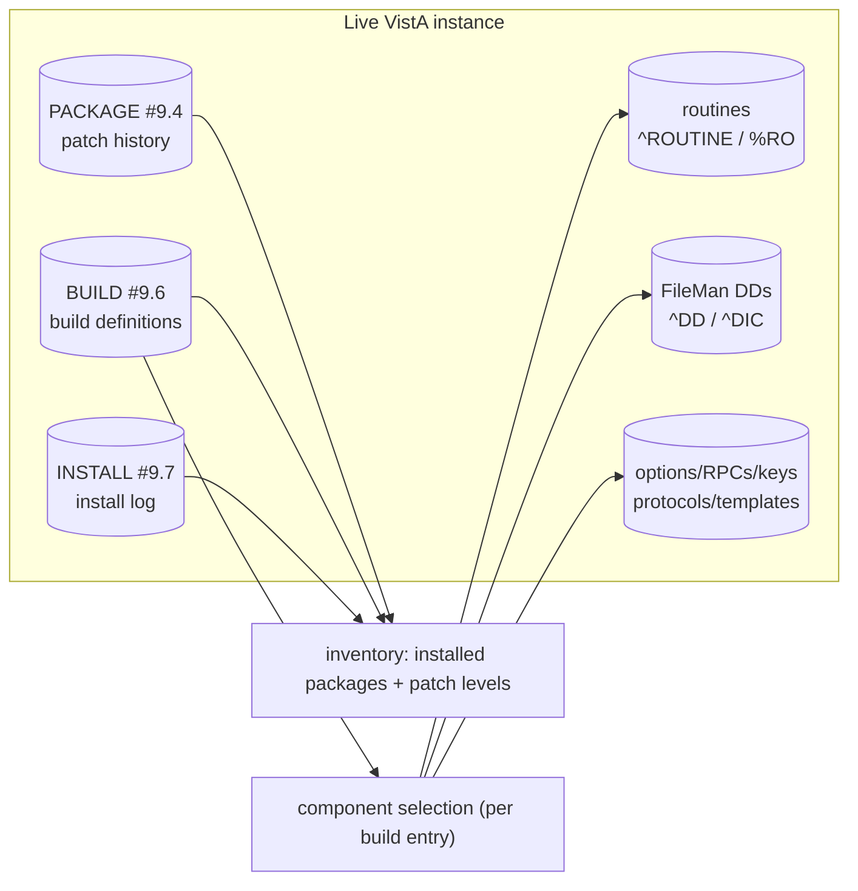
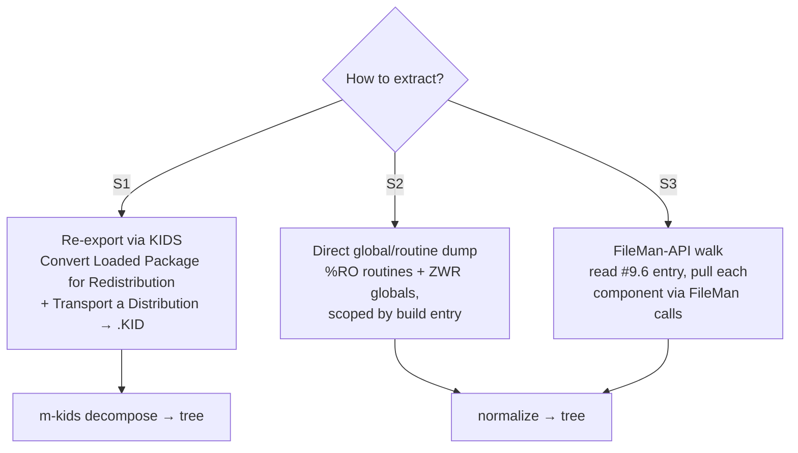
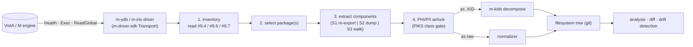
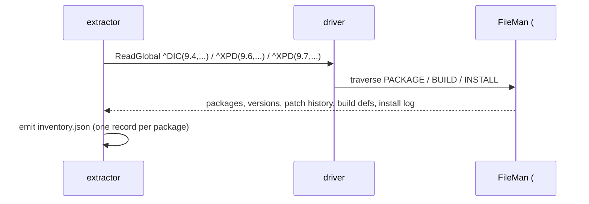
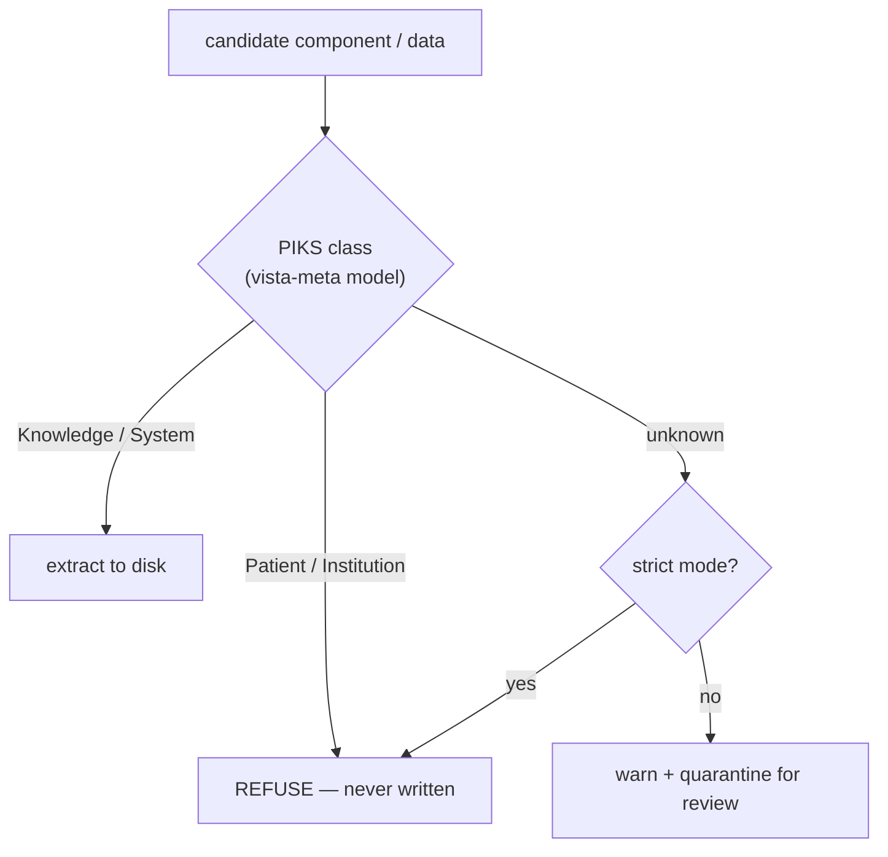

# Design Proposal: Automated Extraction of Installed VistA Packages to the Filesystem

A proposal for **pulling the installed software of a running VistA/M instance out
to a git-friendly filesystem tree**, for analysis, diffing, drift detection, and
archival. This is the *inbound* (system → filesystem) counterpart to
[`kids-installation-automation.md`](kids-installation-automation.md) (filesystem
→ system) and feeds directly into [`m-kids`](architecture.md) `decompose`.

Status: **design proposal.** It specifies the approach, the authoritative
mechanisms it builds on, and the open questions — it is not yet implemented.

---

## Table of Contents

- [1. Motivation](#1-motivation)
- [2. What "installed packages" means in VistA](#2-what-installed-packages-means-in-vista)
- [3. Three extraction strategies](#3-three-extraction-strategies)
- [4. Recommended architecture](#4-recommended-architecture)
- [5. The package inventory](#5-the-package-inventory)
- [6. Extraction by component type](#6-extraction-by-component-type)
- [7. The on-disk layout](#7-the-on-disk-layout)
- [8. PHI/PII safety — the data airlock](#8-phipii-safety--the-data-airlock)
- [9. Engine-neutral driver contract](#9-engine-neutral-driver-contract)
- [10. Roadmap & open questions](#10-roadmap--open-questions)
- [References](#references)

---

## 1. Motivation

The toolchain can already take a `.KID` apart (`m-kids decompose`) and put it
back together (`assemble`). But a *live* VistA instance is not a `.KID` — it is
years of accumulated installs, local modifications, and patches whose original
distributions may be long gone. To analyze what is *actually running* (for
security review, drift detection vs. a known-good baseline, migration planning,
or simply to get a package under version control), we need to **reconstruct
distributable artifacts from the live system**.

Goals:

- Enumerate installed packages and their patch levels.
- For a selected package, extract its components (routines, files/DDs, options,
  protocols, RPCs, keys, templates) to a filesystem tree.
- Normalize to a form that diffs cleanly and feeds `m-kids decompose` (ideally:
  reconstruct a `.KID`, then decompose it, so extraction and authoring share one
  representation).
- Never let Patient/Institution-class operational data leak to disk.

---

## 2. What "installed packages" means in VistA

KIDS leaves three authoritative records on every system: [1]

| File              | Role                                                                 |
| ----------------- | -------------------------------------------------------------------- |
| **PACKAGE (#9.4)** | static, non-version-specific package info + **patch history** (PATCH APPLICATION HISTORY multiple inside the VERSION multiple). The "what's installed & at what patch" record. |
| **BUILD (#9.6)**   | the *build entries* — each defines the set of files, components, install questions, and pre/post-install routines that made up an exported build. A site retains build entries after install, so the definition is inspectable. |
| **INSTALL (#9.7)** | one entry per installation performed on the site: answers, output, timing, status. The "what happened, when" record. |



The crucial insight: **`#9.6` build entries already enumerate a package's
components**. Extraction is largely "walk the build entry, pull each named
component out of its home file." This is exactly what KIDS does in reverse when
it exports — and VistA already provides the option that does it.

---

## 3. Three extraction strategies



**S1 — Re-export through KIDS (preferred when a build entry exists).**
KIDS itself can repackage installed software. The
`Convert Loaded Package for Redistribution [XPD CONVERT PACKAGE]` option turns a
*loaded* distribution into an export-ready form and creates build entries; the
`Transport a Distribution [XPD TRANSPORT PACKAGE]` option then writes a `.KID`
to a Host File. [1] If a current build entry (`#9.6`) exists for the package, a
developer can re-transport it directly. The output is a real `.KID`, so we get
extraction *and* `m-kids` decompose for free, sharing one representation.

> Caveat: `XPD CONVERT PACKAGE` operates on *loaded* distributions; transporting
> an *already-installed* package generally relies on a present/rebuilt `#9.6`
> build entry. Where no usable build entry exists, fall back to S2/S3.

**S2 — Direct dump.** Export routines with the standard routine utility (`^%RO`
/ Kernel routine tools) and dump the relevant globals in **ZWR** (the same
`label,sub) = value` form `m-kids` already reads/writes for KRN components). Scope
the dump using the build entry's component list. Fast and engine-portable, but we
re-implement the "which nodes belong to this component" logic KIDS owns.

**S3 — FileMan-API walk.** Read the `#9.6` entry, then for each referenced
component read it out via FileMan/DBS calls (`^DD`, `^DIC`, file traversal).
Highest fidelity for FileMan-defined components, most code.

A production extractor likely uses **S1 where a build entry exists, S2/S3 to
fill gaps** (locally modified routines, components not in any build entry).

---

## 4. Recommended architecture



The extractor is a thin orchestrator over the **`m-driver-sdk` Transport seam**
(`Health · Load · Exec · ReadGlobal · SetGlobal`), so it runs unchanged against
YottaDB (`m-ydb`) or IRIS (`m-iris`). Wherever possible it produces a `.KID` and
hands off to `m-kids decompose`, so there is exactly one filesystem
representation across authored-and-extracted code.

---

## 5. The package inventory

The first deliverable is read-only and low-risk — a structured manifest of what
is installed:



```json
{
  "package": "KERNEL",
  "namespace": "XU",
  "fileNumber": 9.4,
  "currentVersion": "8.0",
  "patches": [
    {"name": "XU*8.0*504", "seq": 504, "installed": "2018-08-10", "by": "XUUSER,TEN", "status": "Completed"}
  ],
  "buildEntries": ["XU*8.0*504"],
  "componentCounts": {"ROUTINE": 2, "OPTION": 3, "REMOTE-PROCEDURE": 2, "SECURITY-KEY": 1}
}
```

This mirrors what the `Display Patches for a Package [XPD PRINT PACKAGE PATCHES]`,
`Build File Print [XPD PRINT BUILD]`, and `Install File Print` options show a
human — automated and machine-readable. [1]

---

## 6. Extraction by component type

The build entry (`#9.6`) enumerates components; each type has a home and an
extraction method:

| Component                       | Home / source                     | Extraction                                   |
| ------------------------------- | --------------------------------- | -------------------------------------------- |
| Routines                        | `^ROUTINE` (or engine routine dir) | `^%RO` / Kernel routine tools → `.m`         |
| FileMan files & data dictionary | `^DD`, `^DIC`                      | ZWR dump / FileMan DBS → per-file `.zwr`     |
| Options                         | OPTION `#19`                      | FileMan/ZWR by entry → `KRN/OPTION/*.zwr`    |
| Remote procedures (RPCs)        | REMOTE PROCEDURE `#8994`          | ZWR by entry → `KRN/REMOTE-PROCEDURE/*.zwr`  |
| Protocols                       | PROTOCOL `#101`                   | ZWR by entry → `KRN/PROTOCOL/*.zwr`          |
| Security keys                   | SECURITY KEY `#19.1`             | ZWR by entry → `KRN/SECURITY-KEY/*.zwr`      |
| Templates (PRINT/SORT/INPUT)    | within the host file's DD          | FileMan / ZWR                                |
| Forms, Functions, Bulletins, Help Frames | respective files          | ZWR by entry                                 |

(The component-type list is exactly KIDS's own: Template, Form, Function,
Bulletin, Help Frame, Routine, Option, Security Key, Protocol — plus FileMan
files. [1]) Producing `KRN/<TYPE>/<name>.zwr` and `Routines/<NAME>.m` files makes
the extractor output **byte-compatible with `m-kids decompose`'s tree**, so the
two pipelines converge.

---

## 7. The on-disk layout

Reuse the `m-kids` `KIDComponents/` layout so extracted and authored trees are
indistinguishable to downstream tooling:

```
extracted/
└── KERNEL/
    ├── inventory.json
    └── XU_8.0_504/
        └── KIDComponents/
            ├── Build.zwr            # reconstructed/read #9.6 entry
            ├── Package.zwr          # #9.4 linkage
            ├── Routines/
            │   ├── XU8P504.m
            │   └── XUSKAAJ1.m
            └── KRN/
                ├── OPTION/XUS-KAAJEE-WEB-LOGON.zwr
                ├── REMOTE-PROCEDURE/XUS-KAAJEE-GET-CCOW-TOKEN.zwr
                └── SECURITY-KEY/XUKAAJEE_SAMPLE.zwr
```

Then `m-kids canonicalize` can stabilize install-time IENs for cross-instance
diffing, and `m-kids assemble` can turn an extracted tree back into a `.KID` if
needed.

---

## 8. PHI/PII safety — the data airlock

Extraction touches a live system that contains real patient data — this is the
single most important constraint.



- Extract **definitions** (DDs, options, routines) freely; **operational data**
  (`DATA`/`FRV*` populating Patient- or Institution-class files) is refused by
  default. This is the same **PIKS data-class gate** `m-kids lint` enforces (gate
  K2), with the authoritative classification consumed *by reference* from
  `vista-meta` — never vendored.
- Run the gate **before** writing to disk, not after, so PHI never lands on the
  filesystem even transiently.
- Treat the whole extractor as operating inside the **outbound airlock**: log
  every component written, fail closed on unknown classification with
  `--strict`.

---

## 9. Engine-neutral driver contract

| Step              | Engine-neutral action                                   | Transport verb        |
| ----------------- | ------------------------------------------------------- | --------------------- |
| Connect / health  | confirm instance reachable & namespace correct          | `Health`              |
| Inventory         | read `#9.4` / `#9.6` / `#9.7`                            | `ReadGlobal`          |
| Re-export (S1)    | drive `XPD CONVERT PACKAGE` + `XPD TRANSPORT PACKAGE`    | `Exec`                |
| Dump (S2)         | `^%RO` routines + ZWR globals scoped by build entry      | `Exec` / `ReadGlobal` |
| Walk (S3)         | FileMan reads per component                              | `Exec` / `ReadGlobal` |
| Checksums         | `XINDEX` for routine integrity                           | `Exec`                |

Because everything funnels through the frozen `m-driver-sdk` seam, the extractor
is one codebase that targets both YottaDB and IRIS — consistent with the
`m-engine-drivers` architecture.

---

## 10. Roadmap & open questions

1. **Phase 1 (low risk, high value): inventory only.** Read `#9.4`/`#9.6`/`#9.7`
   → `inventory.json`. No writes to the live system, no PHI exposure. Ship this
   first.
2. **Phase 2: definition extraction (S2/S3)** for a selected package, gated by
   the PIKS airlock, emitting a `KIDComponents/` tree.
3. **Phase 3: S1 re-export** where build entries support it, producing real
   `.KID`s for `m-kids` round-trip.
4. **Open: build-entry completeness.** How much of a long-lived system's running
   code is *not* covered by any retained `#9.6` build entry (local mods, ancient
   patches)? Drives how much S2/S3 fallback is needed.
5. **Open: exact re-export entry points & whether `XPD TRANSPORT PACKAGE` can be
   driven non-interactively** — needs the *KIDS Developer Tools User Guide*
   (gap, §References [4]).
6. **Open: IEN normalization policy** for cross-instance comparison vs.
   reinstall fidelity (`m-kids canonicalize` is lossy by design).

---

## References

1. Department of Veterans Affairs, OIT. *Kernel 8.0 Systems Management: Kernel
   Installation and Distribution System (KIDS) User Guide*, August 2025 —
   PACKAGE (`#9.4`), BUILD (`#9.6`), INSTALL (`#9.7`); `Convert Loaded Package
   for Redistribution [XPD CONVERT PACKAGE]` (§3.4); `Transport a Distribution
   [XPD TRANSPORT PACKAGE]`; `Build File Print [XPD PRINT BUILD]`,
   `Install File Print`, `Display Patches for a Package [XPD PRINT PACKAGE
   PATCHES]` (§3); component-type list (§2). VDL, Infrastructure → Kernel.
   <https://www.va.gov/vdl/documents/Infrastructure/Kernel/krn_8_0_sm_kids_ug.pdf>
2. Department of Veterans Affairs. *VA FileMan Developer's Guide* — `^DD`/`^DIC`
   structures, DBS calls for reading file definitions and entries. VDL,
   Infrastructure → VA FileMan. <https://www.va.gov/vdl/application.asp?appid=5>
3. Department of Veterans Affairs. *Kernel 8.0 & Kernel Toolkit 7.3 Technical
   Manual* — routine tools (`^%RO`), `XINDEX` checksums, and the home files for
   options (`#19`), RPCs (`#8994`), protocols (`#101`), security keys (`#19.1`).
   VDL, Infrastructure → Kernel. <https://www.va.gov/vdl/application.asp?appid=10>
4. Department of Veterans Affairs. *Kernel 8.0 Developer's Guide: KIDS Developer
   Tools User Guide* — developer export/transport internals and any
   non-interactive transport APIs. *(Recommended fetch — not yet in the gold
   corpus.)* VDL, Infrastructure → Kernel.
5. `vista-meta` — the authoritative PIKS (Patient/Institution/Knowledge/System)
   classification over FileMan files, consumed by reference for the data
   airlock. (Internal `vista-cloud-dev` project.)
6. OSEHRA / WorldVistA — community references on global/routine export (`%RO`,
   ZWR) and the `.KID` transport-global format.
   <https://github.com/WorldVistA>
