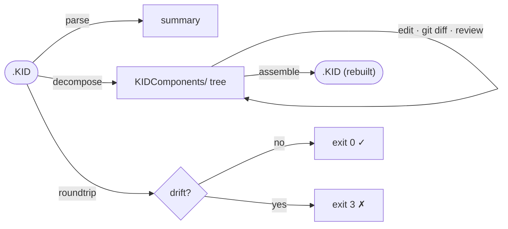
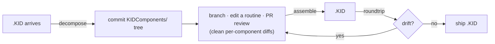

# m-kids — End-to-End User Guide

A hands-on walkthrough of assembling and disassembling a real VistA KIDS build
with `m-kids`. Everything here is runnable from a clone of the repo; the sample
artifacts in this directory were produced by the exact commands shown.

---

## Table of Contents

- [1. What you'll do](#1-what-youll-do)
- [2. Prerequisites](#2-prerequisites)
- [3. The sample build](#3-the-sample-build)
- [4. Quick start: the demo script](#4-quick-start-the-demo-script)
- [5. Step by step](#5-step-by-step)
  - [5.1 parse](#51-parse)
  - [5.2 decompose](#52-decompose)
  - [5.3 inspect the tree](#53-inspect-the-tree)
  - [5.4 assemble](#54-assemble)
  - [5.5 roundtrip](#55-roundtrip)
  - [5.6 lint](#56-lint)
  - [5.7 canonicalize](#57-canonicalize)
- [6. The git workflow](#6-the-git-workflow)
- [7. Exit codes & JSON output](#7-exit-codes--json-output)
- [8. Files in this directory](#8-files-in-this-directory)
- [References](#references)

---

## 1. What you'll do

You will take a monolithic `.KID` distribution file apart into a per-component
tree (so it diffs cleanly in git), put it back together into an installable
`.KID`, and prove the round-trip introduced no drift.



For the full design, see [`../docs/architecture.md`](../docs/architecture.md).

---

## 2. Prerequisites

- Go 1.26+ (builds are pure-Go, `CGO_ENABLED=0`).
- From the repo root, build the binary:

```sh
make build          # produces dist/m-kids
```

All commands below assume `dist/m-kids` is on your path or invoked as
`./dist/m-kids`.

---

## 3. The sample build

This directory ships a real Kernel patch:

- **`XU_8.0_504.KID`** — VistA build **`XU*8.0*504`**, the KAAJEE proxy-logon
  patch. It contains 2 routines, 3 options, 2 RPCs, and a security key — a
  compact but representative cross-section of KIDS component types.

> Why a real patch? Synthetic fixtures hide the messy parts (routine line-2
> stamps, per-entry KRN nodes, install questions). `XU*8.0*504` exercises them.

---

## 4. Quick start: the demo script

Run the whole pipeline end-to-end:

```sh
examples/roundtrip-demo.sh
```

It builds the binary if needed, works in a throwaway temp dir, and prints each
step. The captured output is committed alongside as
[`transcript.txt`](transcript.txt). The script's exit status is the
`roundtrip` result (`0` = the build reproduced exactly).

---

## 5. Step by step

### 5.1 parse

Summarize a `.KID` without unpacking it — install names plus a per-section
subscript count:

```sh
m-kids parse examples/XU_8.0_504.KID
```

```json
{
  "data": {
    "installNames": ["XU*8.0*504"],
    "builds": [{
      "name": "XU*8.0*504",
      "subscripts": 257,
      "sections": {"BLD":69,"INIT":1,"KRN":84,"MBREQ":1,"ORD":6,"PKG":9,"QUES":35,"RTN":51,"VER":1}
    }]
  }
}
```

`RTN` is the routine source, `KRN` the Kernel components (options/RPCs/keys),
`BLD` the build entry itself, `QUES` the install questions.

### 5.2 decompose

Explode the `.KID` into a per-component tree:

```sh
m-kids decompose examples/XU_8.0_504.KID ./out
```

This writes `./out/XU_8.0_504/KIDComponents/…`. A pre-generated copy of that
exact tree is committed here under [`decomposed/`](decomposed/) so you can browse
it without running anything.

### 5.3 inspect the tree

```
XU_8.0_504/KIDComponents/
├── Build.zwr            ├── Routines/
├── Package.zwr          │   ├── XU8P504.m / .header
├── KernelFMVersion.zwr  │   └── XUSKAAJ1.m / .header
├── PostInstall.zwr      └── KRN/
├── RequiredBuild.zwr        ├── OPTION/XUS-KAAJEE-WEB-LOGON.zwr
├── InstallQuestions.zwr     ├── REMOTE-PROCEDURE/XUS-KAAJEE-GET-CCOW-TOKEN.zwr
└── ORD.zwr                  └── SECURITY-KEY/XUKAAJEE_SAMPLE.zwr
```

A routine is plain MUMPS source you can diff line-by-line
(`Routines/XU8P504.m`); each Kernel component is its own small ZWR file
(`KRN/OPTION/XUS-KAAJEE-WEB-LOGON.zwr`), so two unrelated options never collide
in a merge.

### 5.4 assemble

Rebuild an installable `.KID` from the tree. Point `assemble` at the directory
**containing** `<build>/KIDComponents/` (i.e. the decompose output dir, *not* the
build dir itself):

```sh
m-kids assemble ./out ./rebuilt.KID
```

```json
{ "data": { "outputKid": "./rebuilt.KID", "installNames": ["XU*8.0*504"] } }
```

### 5.5 roundtrip

The oracle: decompose → assemble → re-parse, then compare. Exit `3` on any
drift.

```sh
m-kids roundtrip examples/XU_8.0_504.KID    # exit 0 — build reproduced
```

> Round-trip means **semantic equality after routine line-2 canonicalization**,
> not byte-identity: the volatile `;;…;;patches;date;Build N` pieces are blanked
> because KIDS rewrites them on every install. See
> [architecture §7](../docs/architecture.md#7-the-round-trip-guarantee).

### 5.6 lint

The PIKS data-class gate (gate K2): refuses a `.KID` carrying operational data
for a Patient- or Institution-class FileMan file. `XU*8.0*504` ships no such
data, so it passes:

```sh
m-kids lint examples/XU_8.0_504.KID          # exit 0
m-kids lint patch.KID --piks piks.tsv        # authoritative vista-meta table
m-kids lint patch.KID --strict               # fail-closed on unclassified files
```

### 5.7 canonicalize

**Lossy, review-only.** Substitute install-time IENs with the literal `"IEN"` so
the same component diffs identically across instances. Never feed a canonicalized
tree to `assemble` for a real install:

```sh
m-kids canonicalize ./out/XU_8.0_504/KIDComponents
```

---

## 6. The git workflow



1. `decompose` the vendor/upstream `.KID`, commit the tree.
2. Edit components on a branch; review diffs per routine/option.
3. `assemble` back to a `.KID`; `roundtrip` to confirm no drift.
4. Install the `.KID` (see
   [`../docs/kids-installation-automation.md`](../docs/kids-installation-automation.md)).

---

## 7. Exit codes & JSON output

Every command follows the toolchain contract:

| Exit | Meaning             |
| ---- | ------------------- |
| `0`  | ok                  |
| `1`  | runtime error       |
| `2`  | usage error         |
| `3`  | check / drift / gate blocked |
| `4`  | refused             |

Add `--output json` for machine-readable output (the default when stdout is not
a TTY), `--output text` to force styled text, or pipe to `jq`:

```sh
m-kids parse examples/XU_8.0_504.KID --output json | jq '.data.builds[0].sections'
m-kids schema | jq .          # full command/flag tree for agents
```

---

## 8. Files in this directory

| Path                  | What it is                                              |
| --------------------- | ------------------------------------------------------- |
| `XU_8.0_504.KID`      | the sample build (real Kernel KAAJEE proxy-logon patch) |
| `roundtrip-demo.sh`   | runnable end-to-end walkthrough (parse→…→lint)          |
| `transcript.txt`      | captured output of the demo script                      |
| `decomposed/`         | the committed `KIDComponents/` tree for browsing        |
| `USER_GUIDE.md`       | this guide                                              |

---

## References

1. Department of Veterans Affairs, OIT. *Kernel 8.0 Systems Management: Kernel
   Installation and Distribution System (KIDS) User Guide*, August 2025 — the
   authoritative description of builds, transport globals, and the `.KID` format.
   VDL, Infrastructure → Kernel.
   <https://www.va.gov/vdl/documents/Infrastructure/Kernel/krn_8_0_sm_kids_ug.pdf>
2. `m-kids` architecture — [`../docs/architecture.md`](../docs/architecture.md).
3. `py-kids-vc` / `XPDK2VC` — the predecessors `m-kids` ports.
   <https://github.com/rafael5/py-kids-vc>
